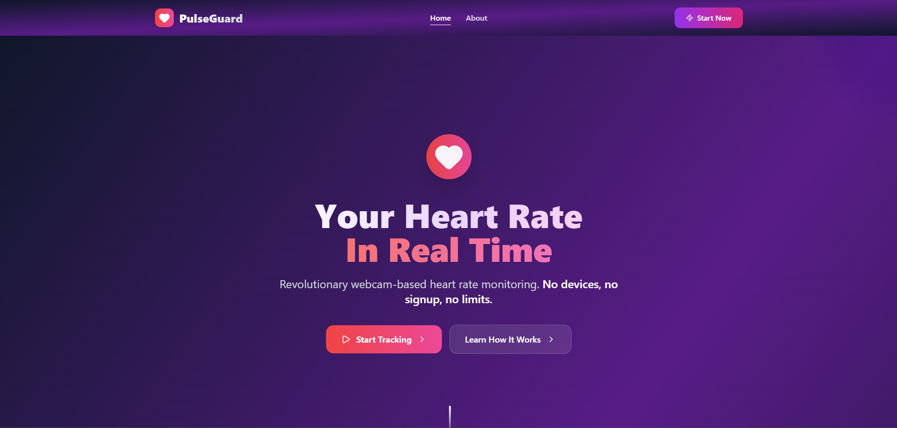
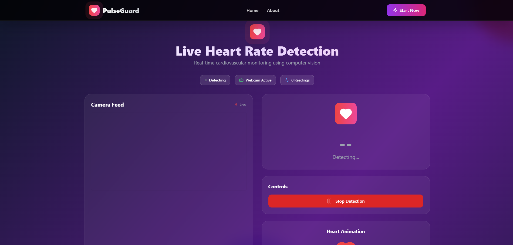

# 💓 PulseGuard

**PulseGuard** is a real-time, browser-based heart rate monitoring application built with **React**. It leverages your device’s webcam to detect subtle color changes on your face (via remote photoplethysmography or rPPG) and estimates your heart rate (BPM) without any physical sensors.
Whether you're a fitness enthusiast, health researcher, or simply curious, PulseGuard offers a modern, contactless way to check your pulse—**no wearables required**.

---

## 📸 Live Demo

>   

Try it out on desktop for the best experience!

---

## 🚀 Features

### 🎯 Real-Time Heartbeat Detection

* **Contactless Pulse Monitoring** via webcam using changes in green channel intensity.
* **Real-time BPM Estimation** with animated heart sync.
* **Start/Stop Controls** for session flexibility.

### 📈 Signal Analysis

* Real-time charting of green intensity signals.
* Historical BPM tracking per session.
* Displays a **"Not enough data"** notice when signal quality is poor.

### 🧠 Intelligent UI/UX

* **First-Time Instruction Modal** to guide users through setup.
* "Don't show again" checkbox stored in localStorage.
* Fully **responsive design** across mobile, tablet, and desktop.

### 🧭 Smooth Navigation

* Header with active link highlighting.
* Mobile menu toggle with animations.
* Clean and intuitive routing with React Router.

### 🧩 Modular Components

* `WebcamFeed` – Real-time video with face tracking overlay.
* `HeartbeatDisplay` – Live BPM output.
* `HeartbeatAnimation` – Pulsing heart synced to BPM.
* `GreenSignalChart` & `BPMChart` – Realtime + historical graphs.
* `Controls` – Toggle heartbeat detection.
* `FAQs` – Expandable section with user guidance.

---

## 📦 Tech Stack

* **React** (with Vite)
* **Tailwind CSS** for modern responsive styling
* **React Router DOM** for client-side routing
* **Chart.js** for visual data representation
* **Lucide-react** for elegant icons
* **Webcam API** for live feed access
* Custom **rPPG signal processing** logic (built from scratch)

---

## 🛠️ Getting Started

### ✅ Prerequisites

* Node.js v18+ recommended
* Chrome, Firefox, or any modern browser with webcam access

### 🚀 Setup Instructions

```bash
git clone https://github.com/Dev-Rodiyat/PulseGuard.git
cd PulseGuard
npm install
npm run dev
```

Then open your browser at `http://localhost:5173`.

---

## 🧭 Project Structure

```
📁 src
├── components         # UI elements (charts, controls, animation, etc.)
├── hooks              # Custom detection logic (e.g., useHeartRateDetector)
├── pages              # App pages: Home, About, Detection
├── App.jsx            # App root with routing
├── main.jsx           # App entry point
└── styles             # Tailwind configuration & base styles
```

---

## 📌 How to Use

1. Ensure you’re in a well-lit environment.
2. Sit still with your face clearly visible to the webcam.
3. Click **Start** to begin detection.
4. Allow 10–20 seconds for readings to stabilize.
5. Click **Stop** when finished or to pause.

---

## ✅ Roadmap / TODO

### 🔧 Functionality

* [ ] Improve BPM estimation using adaptive peak detection
* [ ] Display average BPM per session
* [ ] Allow export of BPM data (CSV / JSON)
* [ ] Toggle dark/light mode
* [ ] Add session timer & session history tracking

### 🧪 Accuracy & Validation

* [ ] Add signal confidence/quality indicator
* [ ] Allow manual BPM input for comparison
* [ ] Research AI-based signal enhancement

### 🧠 UI/UX Improvements

* [ ] Add multi-step onboarding experience
* [ ] Add tooltips and contextual help
* [ ] Translate into multiple languages (i18n)
* [ ] Animate page transitions

### 📱 PWA Support

* [ ] Add service worker for offline support
* [ ] Enable “Add to Home Screen” for mobile

### 🔐 Security Enhancements

* [ ] Graceful webcam permission handling
* [ ] Pause detection when tab is inactive or browser is minimized
* [ ] Prompt user before starting webcam feed

---

## 🤝 Contributing

We welcome all contributions!
You can:

* Submit issues and suggestions
* Open a PR for improvements or bug fixes
* Help validate accuracy against other tools

Make sure to fork the repo and create a branch off of `main`.

---

## 🧠 Project Motivation

> PulseGuard is inspired by the need for quick, accessible, and non-invasive heart rate tracking.
> It's particularly useful for:

* Individuals with high blood pressure who want to avoid frequent hospital visits.
* Developers and researchers exploring modern health tech.
* Fitness and wellness apps seeking to expand into rPPG monitoring.

---

## 🙏 Acknowledgements

* **rPPG research** – For non-contact pulse measurement insights
* **React**, **Tailwind CSS**, **Chart.js** – Open source UI powerhouses
* Everyone in the **health-tech dev community** 💚💚
